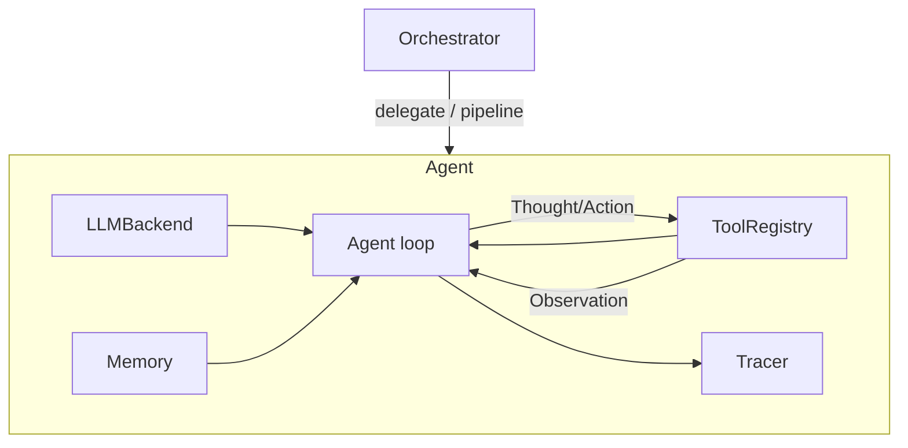

# AgentForge

**A lightweight, fully-typed framework for building, orchestrating, and
observing multi-agent LLM systems.**

[](https://github.com/YOUR_USERNAME/agentforge/actions/workflows/ci.yml)
[](LICENSE)
[](pyproject.toml)

AgentForge gives you the five pieces every tool-using agent needs — an LLM
backend, a tool registry, memory, a reasoning loop, and a full trace of what
happened — as small, independently testable modules, plus an `Orchestrator`
for coordinating several agents together. No hidden magic, no 50-file
abstraction maze: the entire core is ~300 lines you can read in ten minutes.

## Why

Most agent frameworks either lock you into one model provider or bury the
reasoning loop under layers of abstraction. AgentForge does the opposite:

- **Provider-agnostic** — agents talk to an `LLMBackend` interface, not a
  specific SDK. Ship with Anthropic's Claude, swap in another provider, or
  run fully offline with the built-in `MockBackend` (used throughout the
  test suite, so CI needs no API key).
- **Observable by default** — every thought, tool call, and observation is
  recorded by a `Tracer`, so you can always answer "why did the agent do
  that?"
- **Small enough to actually read** — the core loop, memory, and tool
  registry are each under 100 lines.

## Architecture



See [`docs/ARCHITECTURE.md`](docs/ARCHITECTURE.md) for the full breakdown.

## Quickstart

```bash
git clone https://github.com/YOUR_USERNAME/agentforge.git
cd agentforge
pip install -e ".[dev]"
pytest                       # runs fully offline, no API key needed
```

Run an agent from the CLI (offline mock backend, no API key required):

```bash
agentforge "What is 12 * 7?"
```

Or wire one up in code with a real model:

```python
from agentforge.agent import Agent
from agentforge.llm.anthropic_backend import AnthropicBackend
from agentforge.tools.builtin import builtin_tools

agent = Agent(
    name="researcher",
    llm=AnthropicBackend(model="claude-sonnet-4-6"),  # needs ANTHROPIC_API_KEY
    tools=builtin_tools,
    persona="You are a meticulous research assistant.",
)

print(agent.run("What is 128 * 47, and how did you get it?"))
print(agent.tracer.render())  # full thought/action/observation trace
```

Coordinate multiple agents with the `Orchestrator`:

```python
from agentforge.orchestrator import Orchestrator

orchestrator = Orchestrator()
orchestrator.register(reviewer_agent)
orchestrator.register(fixer_agent)

result = orchestrator.pipeline("Review this code:\n...", order=["reviewer", "fixer"])
```

Serve agents over HTTP:

```bash
uvicorn api.server:app --reload
# or: docker compose up --build
curl -X POST localhost:8000/agents/run -H "Content-Type: application/json" \
     -d '{"task": "What is 9 * 9?"}'
```

## Project structure

```
agentforge/
├── src/agentforge/
│   ├── agent.py          # the ReAct-style reasoning loop
│   ├── orchestrator.py   # multi-agent delegation / pipelines
│   ├── memory.py         # bounded conversation buffer
│   ├── tracing.py        # structured thought/action/observation log
│   ├── llm/               # pluggable model backends (Anthropic, mock)
│   └── tools/              # tool registry + built-in tools
├── api/server.py          # FastAPI wrapper for serving agents over HTTP
├── examples/               # runnable single-agent and multi-agent examples
├── tests/                  # fully offline unit tests (pytest)
└── docs/                    # architecture notes and roadmap
```

## Examples

- [`examples/research_assistant.py`](examples/research_assistant.py) — a
  single agent using the calculator tool, running on Claude if
  `ANTHROPIC_API_KEY` is set, or the offline mock otherwise.
- [`examples/code_reviewer.py`](examples/code_reviewer.py) — a two-agent
  `reviewer -> fixer` pipeline via the `Orchestrator`.

## Roadmap

Retrieval-augmented memory, parallel fan-out/fan-in orchestration, an
OpenTelemetry exporter, and an evaluation harness are all planned — see
[`docs/ROADMAP.md`](docs/ROADMAP.md) for the full list and
[`CONTRIBUTING.md`](CONTRIBUTING.md) if you'd like to help build one of them.

## License

MIT — see [LICENSE](LICENSE).
