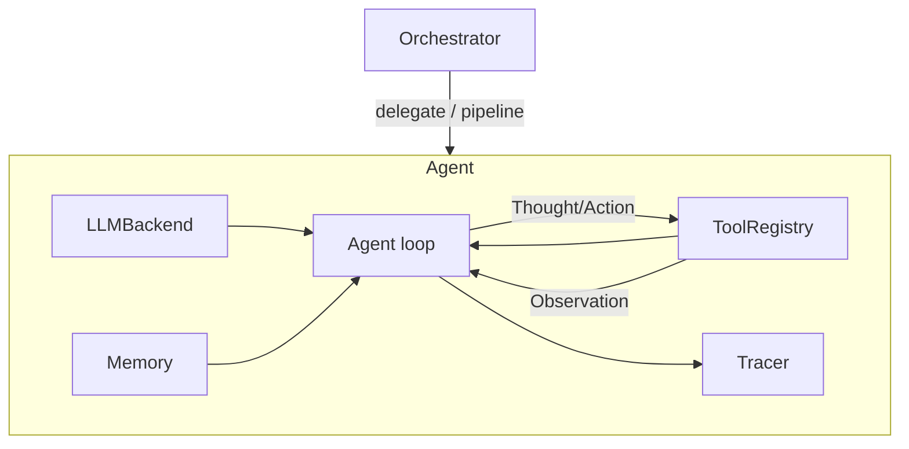

# Architecture

AgentForge is built from five small, independently-testable pieces that
compose into agents and multi-agent systems.

## The pieces

- **`LLMBackend`** (`llm/base.py`) — the only interface an agent talks to.
  `AnthropicBackend` and `MockBackend` both implement it, so swapping models
  or running fully offline is a one-line change.
- **`ToolRegistry`** (`tools/registry.py`) — a named set of callables an
  agent can invoke, plus machine-readable specs for prompting the model.
- **`Memory`** (`memory.py`) — a bounded conversation buffer. Deliberately
  simple today; see the Roadmap for planned summarization and retrieval.
- **`Tracer`** (`tracing.py`) — records every thought, action, and
  observation as a `Step`, giving full visibility into *why* an agent did
  what it did.
- **`Agent`** (`agent.py`) — the ReAct loop that ties the four pieces above
  together: think, optionally act, observe, repeat until a final answer.
- **`Orchestrator`** (`orchestrator.py`) — coordinates several agents, either
  by delegating a single task to one agent, or by piping agents together in
  a pipeline (e.g. `reviewer -> fixer`).

## Why this shape

Each piece has one job and depends only on abstractions, not concrete
implementations (`Agent` depends on `LLMBackend`, never on `AnthropicBackend`
directly). That makes it possible to:

- Test the entire agent loop with zero network calls (`MockBackend`).
- Add a new model provider without touching `Agent`, `Memory`, or `Tracer`.
- Add a new tool without touching anything except `tools/`.
- Swap the orchestration policy (delegate vs. pipeline vs. something fancier)
  without changing how individual agents work.
